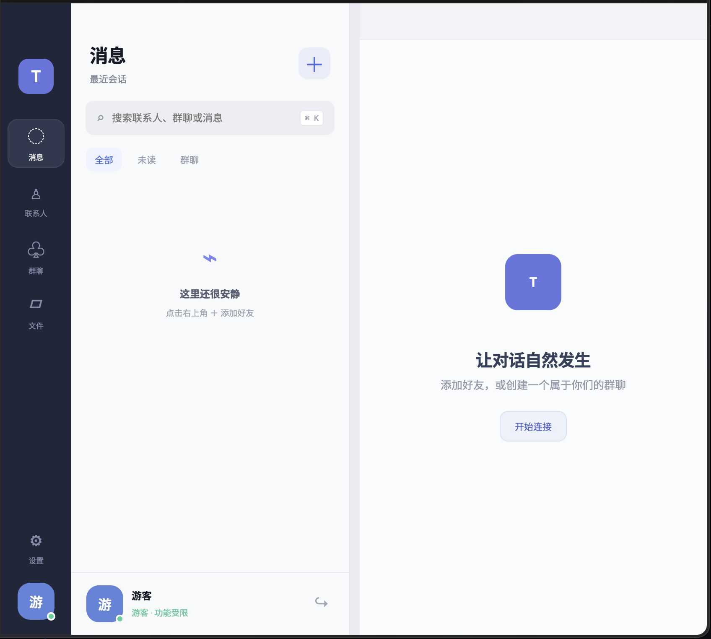

# TalkStation

> [!WARNING]
> **本项目当前尚未完成，仍处于开发阶段。** 部分功能可能不可用或不稳定，界面、数据结构和使用方式也可能继续调整。

TalkStation 是一个基于 Electron 的桌面聊天软件项目，目标是提供登录注册、好友管理、单聊与群聊、实时消息和文件发送等功能。



## 当前状态

- 项目仍在开发中，尚未发布可用版本。
- 当前仓库主要包含 Electron 客户端前端以及服务器后端。
- 已知问题与功能完成度暂未系统整理。

## 已实现功能

- 用户注册、登录及游客访问
- 好友申请与好友列表
- 单聊与群聊
- WebSocket 实时消息
- 图片、文件和语音消息
- 消息撤回与会话管理

## 本地运行

确保已安装 Node.js，然后执行：

```bash
npm install
npm start
```

## 技术栈

- Electron
- HTML、CSS、JavaScript
- Node.js
- HTTP API 与 WebSocket（规划/开发中）
